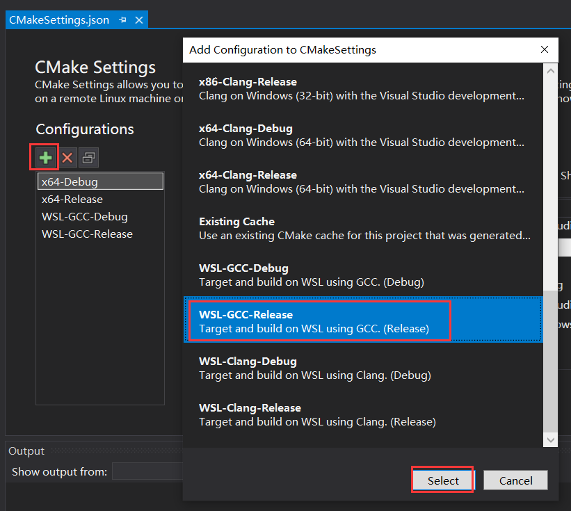

# mirai-cpp-template

 mirai-cpp 机器人的开发模板(CMake)。
 希望可以降低 C++ 新手入门编写 mirai 机器人的难度。

## 使用方法

使用 Visual Studio 或 Visual Studio Code 直接打开整个文件夹即可。

本模板编译目标为可执行文件，其主函数位于 **src/main.cpp** 。

要添加其他 **.cpp** 源文件，不要忘记修改 **CMakeLists.txt**。

不熟悉 CMake 的话可以趁这个机会学习一下。

mirai-cpp 的说明文档：[使用说明](https://github.com/cyanray/mirai-cpp/blob/master/doc/%E4%BD%BF%E7%94%A8%E8%AF%B4%E6%98%8E.md)

## 编译出 Linux 可执行文件、部署到服务器上

操作方法：

1. 在 WSL 上编译出二进制可执行文件
2. 把编译出来的二进制可执行文件复制到自己的服务器上

如果你还不了解什么是 **WSL** (**W**indows **S**ubsystem for **L**inux) ，可以趁这个机会学习一下。

使用 Visual Studio 的 CMake 项目可以很轻松的在 WSL 上进行编译。

按照如图所示步骤，创建一个针对 WSL 平台的配置。因为我的 WSL 安装了 GCC 编译器，所以这里选择 **WSL-GCC-Releas**。

之后将配置切换到刚刚创建的 WSL 平台配置，重新编译项目，编译出来的二进制文件就在 **[本模板所在的目录]/out/build/WSL-Release/** 目录下了(不出意外的话，它叫做 **my-qqrobot** )。

把这个文件复制到你的 Linux 服务器上，可以直接运行哦！
